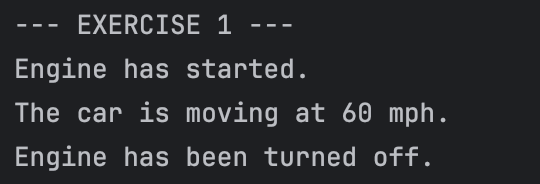
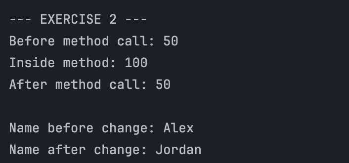
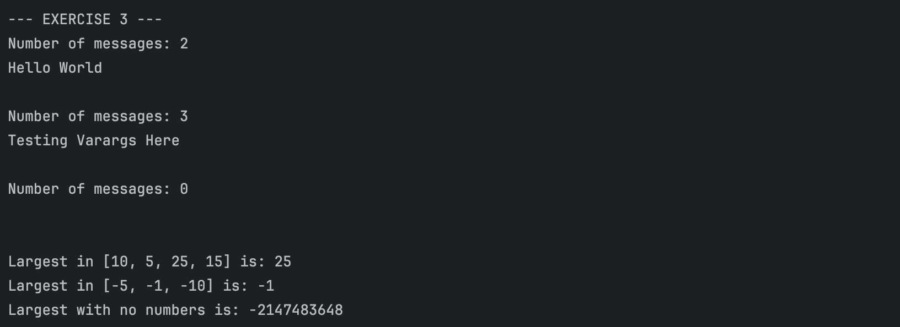
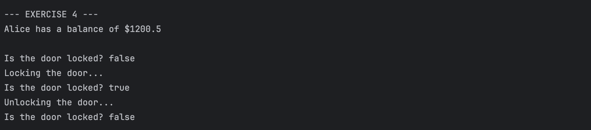
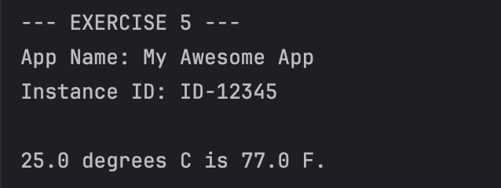
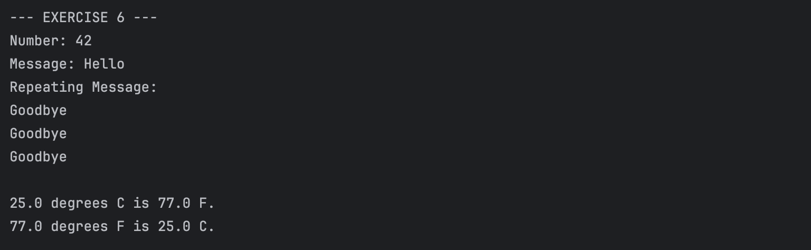
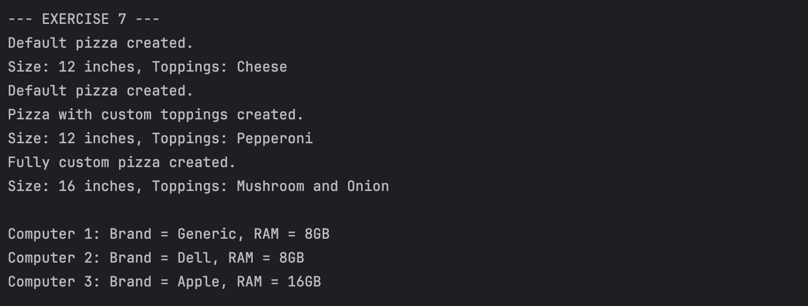
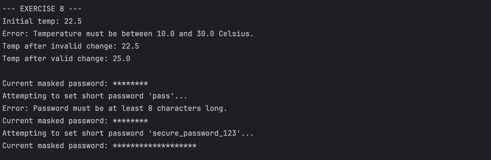

# JC-Exploring-Methods-and-Encapsulation
**Name:** Nuan Patricia Serrano  
**Project Title:** Exploring Methods and Encapsulation 
**Screenshot:**
- Exercise 1: Designing Methods  
    
- Exercise 2: Passing Parameters: Primitives vs. Objects  
    
- Exercise 3: Using Varargs  
    
- Exercise 4: Access Specifiers  
    
- Exercise 5: Static Methods and Variables  
    
- Exercise 6: Method Overloading  
    
- Exercise 7: Constructors and Constructor Overloading  
    
- Exercise 8: Encapsulation  
    